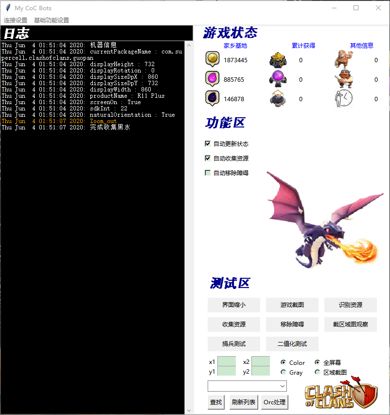

# MyBOTs

## Games
### [Clash Of Clans](https://supercell.com/en/games/clashofclans/)


## Installation

### Windows
- [Python3](https://www.python.org/)
- [Android Studio](https://developer.android.com/studio/#downloads)
- [JDK](https://www.oracle.com/technetwork/java/javase/downloads/jdk8-downloads-2133151.html)
- [Appium](https://github.com/appium/appium-desktop/releases/tag/v1.15.1)
- [uiautomator2](https://github.com/openatx/uiautomator2)
- [uiautomatorviewer] ...\Android\Sdk\tools\bin\uiautomatorviewer
- [tesseract-v5.0.0](https://digi.bib.uni-mannheim.de/tesseract/tesseract-ocr-w64-setup-v5.0.0-alpha.20200328.exe)
```bash
pip install Appium-Python-Client
pip install pytest
pip install simplejson

# Android System Version
adb shell getprop ro.build.version.release
# Current Android Activity
adb shell "dumpsys window w | grep mCurrent"

# install uiautomator2
pip3 install -U uiautomator2
# 安装包含httprpc服务的apk到手机+atx-agent
# 1.3.0之后的版本，当运行python代码u2.connect()时就会自动推送这些文件了）
python -m uiautomator2 init
# install weditor
pip install -U weditor
#Windows系统可以使用命令在桌面创建一个快捷方式 weditor --shortcut
#命令行直接输入 weditor 会自动打开浏览器，输入设备的ip或者序列号，点击Connect即可

adb -s emulator-5556 shell rm /data/local/tmp/minicap
adb -s emulator-5556 shell rm /data/local/tmp/minicap.so

pip freeze > requirements.txt

pip list --outdated | grep 'uiautomator2'
pip list --outdated | finstr 'uiautomator2'


## VirtualEnvironment
python3 -m venv bots
. bots/bin/activate
pip install -r requirements.txt

```

#### 字体库制作
```
tif文件命名格式[lang].[fontname].exp[num].tif
tif命名规则：lang为语言名称，fontname为字体名称，num为图片序号；
比如训练自定义字库 testlang、字体名normal，则命名为testlang.normal.exp0.tif
tesseract tif文件名.tif -l 字体库 box文件名 makebox

tif文件名与box文件名保持一致
tesseract coc_emu_num.normal.exp0.tif coc_emu_num.normal.exp0 –l chi_sim batch.nochop makebox

在cmd窗口中执行echo normal 0 0 0 0 0 >font_properties

5.使用tesseract生成coc_emu_num.normal.exp0.tr训练文件

在终端上执行以下命令：
tesseract coc_emu_num.normal.exp0.tif coc_emu_num.normal.exp0 nobatch box.train
tesseract coc_emu_num.normal.exp0.tif coc_emu_num.normal.exp0 -l chi_sim nobatch box.train
```

### Torch

- PyTorch build : Stable (1.5)
- Your OS : Windows 
- Package : Pip
- Language : Python
- CUDA : 10.1
- Run this Command: pip install torch==1.5.0+cu101 torchvision==0.6.0+cu101 -f https://download.pytorch.org/whl/torch_stable.html
